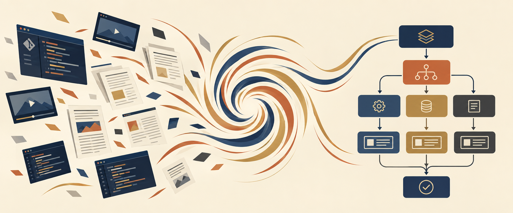

<div align="center">



# 吸星大法 · xxoo

**把别人的东西，化成自己的。**
一个 agent skill：给它一个 GitHub 仓、一篇文章、一段视频、一份 PDF，
它拆成流程图 → **逐环拿你自己的业务去验** → 合成一份只有你有的版本。


适用于 **Claude Code** · **Codex** · **Cursor** · 任何支持 Skills 的 agent

</div>

---

## 名字的故事

金庸写过两门吸别人内力的功夫。

**吸星大法**吸进来化不掉。各家真气堵在体内互相冲撞，平时相安无事，一到真要运功的时候满身乱窜、痛不欲生。任我行练到后来，只能靠不停吸新人来压住旧的——越吸越多，越多越乱，最后在他最风光的那一刻内力反噬，当场倒地。

**北冥神功**能化。吸进来的，就成了自己的。

<div align="center">

</div>

对照一下你自己：

```
装了的 skill          ████████████████████   47
真的跑过的            █                       3

收藏的「稍后读」      ████████████████████  327
真的读完的            ▏                       ?
```

**平时相安无事** —— 不装那些东西，日子照过。

**一到真要干活就发作** —— 这个说必须先做 A，那个说 A 之前得先有 B，
一张八维度评分表摆在面前，你不知道该听谁的。于是关掉，再去找一个新的。

**只能靠吸新的来压** —— 又刷到一个 20k 星的，先 star 了再说，心里舒服十分钟。

这就是入魔。**不是你学得太少，是吸进来的那些化不掉，还在互相打架。**

> 原著里治吸星大法的，不是第九门神功，是《易筋经》。
> 它不给你新内力，它只干一件事：**把你已经吸进去的那些，化掉。**

所以这个 skill 的终点不是「我读懂了」，而是这两样东西：

```
① 一张只有你有的图        —— 别人方案里没有的那部分，是你的
② 一份「还缺什么」清单     —— 写不出缺口，说明这张图还停在纸上
```

**没有这两样，这一轮就是白吸。**

---

## Quick Start

```bash
git clone https://github.com/gmggyyds/xxoo.git
cd xxoo && ./install.sh
```

首次安装会把业务环节清单模板复制成你自己的那份（已存在时不覆盖，且 `.gitignore` 排除，永不进仓）。

然后直接跟你的 AI 说人话：

> *"用吸星大法拆一下 https://github.com/xxx/yyy，看看能不能用到我们的 Listing 环节上"*
> *"这个视频讲的方法，对我们供应链有用吗"*
> *"把这篇文章变成我们自己的版本"*

---

## 为什么要自己写一个（GitHub 已经搜过了）

动手前先把 GitHub 翻了一遍。**萃取这件事，开源做得又多又好：**

| 项目 | ★ | 它做什么 |
|---|---|---|
| [book-to-skill](https://github.com/virgiliojr94/book-to-skill) | 29.7k | 把技术书 PDF 变成一个可安装的 skill |
| [distilly](https://github.com/titanwings/distilly) | 24.6k | 把**一个人**的判断方式蒸馏成 Person Profile |
| [autoharness](https://github.com/tigerless-labs/autoharness) | 3.5k | 从你**自己**的会话里蒸馏 skill，不用的自动淘汰 |
| [DocMeld](https://github.com/agentii-ai/DocMeld) | 100 | PDF → 三段管线 → 生成 PRD / workflow / skill |

还有一整批停在「读完出笔记」这一层：tutor-skills、DeepPaperNote、claude-paper、Bloom。

**但没有一个做第二步。**

全生态的终点都是「你现在懂了 / 你现在有一个 skill 了」。没有任何一个会回过头问你：

> *我手上有五个环节、几条业务线，这套东西逐环对下来——哪环能用、哪环要改、哪环得删？*

**这不是别人没想到，是开源做不了。** 萃取的输入是公开的（书、论文、仓库），能做成通用产品；「对照业务」的输入是私有的——那份业务环节清单只有你自己有。

**所以这一步天然带护城河，也只能自己建。**

---

## 五个 Phase

| Phase | 干什么 | 谁来干 |
|---|---|---|
| **0 · 取材** | 按输入类型分诊：仓 / 文章 / 视频（`yt-dlp`→`whisper`）/ PDF。读不到的**注明缺失，不要猜** | AI |
| **1 · 萃取** | 画成流程图。**只模拟梳理，不执行** | AI（几秒） |
| **2 · 验证** 🔴 | 逐环填四列表：成不成立 ／ 它假设了什么我没有的 ／ **我有什么它没考虑到的** ／ 沿用·删·改 | **你，AI 只能起头** |
| **3 · 自画** | 只基于自己先画一版。**顺序不能反**——先看别人再画自己，画出来的一定是它的变体 | 你 |
| **4 · 合一** | 两份合成一版，每处改动标明来自哪边 | 一起 |

> **Phase 2 是整个 skill 唯一不能交给 AI 的一步。** 上一步 AI 几秒钟干完，这一步得想二十分钟——**这二十分钟才是本事。**

### 硬验收（两条都不满足＝这一轮没真跑）

```
✅ 「删」＋「改」不为零        全部"沿用"＝没拿业务去对，是在读文档
✅ 第三列每一环都填得出东西    这列填不出来的人，就是没在用自己的生意对
```

---

## 实测校准锚

> 2026-09-11 实跑 [`amazon-listing-optimization`](https://github.com/nexscope-ai/Amazon-Skills)（428 行 / 655★）

**428 行的文档，真正的流程只有 11 步**，其余全是模板和输出样板。判定结果：

<div align="center">

| 沿用 | 改 | 删 |
|:---:|:---:|:---:|
| **3** | **8** | **0** |

</div>

三个发现，每一个都写进了 skill 的硬规则：

**① 它的八维度评分里，有两维对品牌模式是反的。**
价格项惩罚溢价——我们比同类中国卖家贵要扣分，可那正是策略；评论项只数星级不看内容——4.8 星 5000 条全在夸"便宜"，打分赢过 4.3 星 200 条全在说"终于睡整觉了"。它还完全没有人群阶段匹配度、复购钩子、用户原话覆盖率。

> **这不是它写得差**——它每条规则放在铺货模式下都成立。**它服务的是"卖货"，我们做的是"围绕一群人"。抄的不是流程，是流程背后那门生意的假设。**

**② 要改的 8 处，全部挤在最前面的「输入」层。**
词从哪来、怎么排序、收什么属性、缺口怎么定义——全在开头；而"怎么写文案""怎么做前后对比"这些**产出层**的东西基本能整段沿用。

> **抄一个东西抄错的地方，通常不在它怎么干活，在它认为该拿什么进来。**

**③ 八个步骤里，没有一步能整步照抄。**
要么是自有的，要么是两边合成的，纯借鉴的一步都没有。

---

## 目录

```
xxoo/
├── SKILL.md                        主流程：5 个 Phase + 硬规则 + 时间预算
└── references/
    ├── verify-table.md             ← Phase 2 的表、提示词、硬验收、实测样例
    ├── find-and-pick.md            去哪找、四条判据、非 GitHub 输入怎么挑
    ├── business-rings.md           你的业务环节清单（对照用，私有）
    └── no-drawing-tool.md          对方没画图工具时的 mermaid → 飞书白板路径
```

## 挑什么值得吸

```
① star > 100        有人真用过，不是个人练手
② 三个月内有更新     没死。AI 生态半年一代
③ 目录能对上你的环节  对不上就别硬吸
④ 单份 200–600 行    太短没结构，太长一次吃不完
```

**一条通用判断**：看它有没有「什么时候该回头 / 该换路」的描述。只写"第一步第二步第三步"的材料，萃取出来是一条直线，学不到东西；**真正有价值的材料里一定有分支和回退——那些才是作者踩过坑的地方。**

---

## 相关

- **`the-great-me`** — 把**我自己**的经验变成 AI 能用的（向内）。和本 skill 是一对：

  ```
  the-great-me   我把自己的      变成 AI 能用的
  xxoo         我把别人的      变成我能用的
  ```
- **选型类 skill** — 回答「要不要装」。本 skill 回答「已经决定学了，怎么化」。**先选型，再吸。**
- **公司 / 品牌调研类 skill** — 拆的是一个**组织**。本 skill 拆的是**一份方法**。

---

<div align="center">

**吸进来，得化得掉。**

</div>
