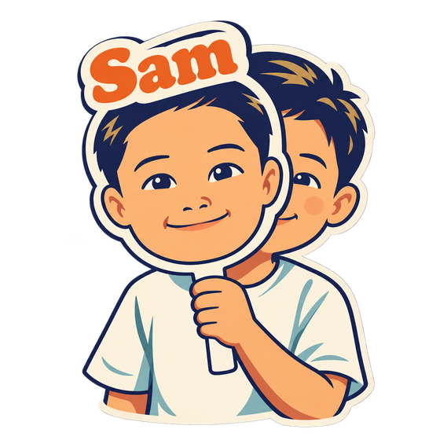

<div align="center">


# 吸星大法 · xxoo

**把别人的东西，化成自己的。**

给它一个 GitHub 仓、一篇文章、一段视频、一份 PDF，
它拆成流程图 → **逐环拿你自己的业务去验** → 合成一份只有你有的版本。

<p>


</p>

适用于 **Claude Code** · **Codex** · **Cursor** · 任何支持 Skills 的 agent

</div>

---

## 📦 装

```bash
git clone https://github.com/gmggyyds/xxoo.git
cd xxoo && ./install.sh
```

然后直接跟你的 AI 说人话：

> *"用吸星大法拆一下 `github.com/xxx/yyy`，看看能不能用到我们的 Listing 环节上"*
>
> *"这个视频讲的方法，对我们供应链有用吗"*
>
> *"把这篇文章变成我们自己的版本"*

首次安装会把业务环节清单模板复制成你自己的那份（已存在时不覆盖，`.gitignore` 排除，永不进仓）。

---

## 🎯 它解决什么

**AI 跑得太快，人学得太慢。**

每天都有新的 skill、新的仓、新的方法论开源出来。你 star 了一堆，一个都没真用起来——
不是你懒，是**没有一套把它变成自己的东西的办法**。

看那些「天塌了」的 AI 新闻和短视频不叫学习，那叫焦虑。真正的学法只有一条：
**找到官方说明，甚至源代码，用流程图把它抽象出来，再拿自己的业务逐环去对。**

为什么流程图管用？因为 **skill 本质上就是给 AI 看的 SOP**——
不管它有多少个文件、洋洋洒洒写了多少字，底下都是一套业务流程。
既然是流程，就一定能用判断和循环画出来。

xxoo 就是把这套办法固化成了一个 skill。终点只认两样东西：

```
① 一张只有你有的图        别人方案里没有的那部分，是你的
② 一份「还缺什么」清单     写不出缺口，说明这张图还停在纸上
```

---

## ⚖️ 差别在哪

<table>
<tr>
<td width="50%" valign="top">

### 只看一眼

> 哦，这个 skill 是做 Listing 优化的。
>
> 有八个维度打分，标题、五点、图片、A+、描述、价格、评论、SEO，挺全的。写得挺专业。
>
> Star 一下，收藏夹里躺着。
>
> *三个月后：这个 skill 是干嘛来着？*

</td>
<td width="50%" valign="top">

### 跑完 xxoo

> 428 行的文档，真正的流程只有 **11 步**，其余全是模板。
>
> 逐环对下来：**沿用 3 / 改 8 / 删 0**。
>
> 八个维度里**有两个对我是反的**——价格项惩罚溢价，而溢价正是我的策略；评论项只数星级不看内容。它还漏了我最看重的三项。
>
> 要改的 8 处**全挤在最前面的输入层**。
>
> *产出：一张我自己的流程图 + 一份「还缺什么」清单。*

</td>
</tr>
</table>

---

## 🥋 名字的故事

金庸写过两门吸别人内力的功夫。

**吸星大法**吸进来化不掉。各家真气堵在体内互相冲撞，平时相安无事，一到真要运功的时候满身乱窜、痛不欲生。任我行练到后来，只能靠不停吸新人来压住旧的——越吸越多，越多越乱，最后在他最风光的那一刻内力反噬，当场倒地。

**北冥神功**能化。吸进来的，就成了自己的。

<div align="center">

</div>

对照一下你自己：

```
装了的 skill          ████████████████████   47
真的跑过的            █                       3

收藏的「稍后读」      ████████████████████  327
真的读完的            ▏                       ?
```

**平时相安无事** —— 不装那些东西，日子照过。

**一到真要干活就发作** —— 这个说必须先做 A，那个说 A 之前得先有 B，一张八维度评分表摆在面前，你不知道该听谁的。于是关掉，再去找一个新的。

**只能靠吸新的来压** —— 又刷到一个 20k 星的，先 star 了再说，心里舒服十分钟。

这就是入魔。**不是你学得太少，是吸进来的那些化不掉，还在互相打架。**

> 原著里治吸星大法的，不是第九门神功，是《易筋经》。
> 它不给你新内力，它只干一件事：**把你已经吸进去的那些，化掉。**

---

## 🔍 为什么自己写一个

动手前先把 GitHub 翻了一遍。**萃取这件事，开源做得又多又好：**

| 项目 | ★ | 它做什么 |
|---|---|---|
| [book-to-skill](https://github.com/virgiliojr94/book-to-skill) | 29.7k | 把技术书 PDF 变成一个可安装的 skill |
| [distilly](https://github.com/titanwings/distilly) | 24.6k | 把**一个人**的判断方式蒸馏成 Person Profile |
| [autoharness](https://github.com/tigerless-labs/autoharness) | 3.5k | 从你**自己**的会话里蒸馏 skill，不用的自动淘汰 |
| [DocMeld](https://github.com/agentii-ai/DocMeld) | 100 | PDF → 三段管线 → 生成 PRD / workflow / skill |

还有一整批停在「读完出笔记」这一层：tutor-skills、DeepPaperNote、claude-paper、Bloom。

**但没有一个做第二步。**

全生态的终点都是「你现在懂了 / 你现在有一个 skill 了」。没有任何一个会回过头问你：

> *我手上有五个环节、几条业务线，这套东西逐环对下来——哪环能用、哪环要改、哪环得删？*

**这不是别人没想到，是开源做不了。** 萃取的输入是公开的（书、论文、仓库），能做成通用产品；「对照业务」的输入是私有的——那份业务环节清单只有你自己有。

**所以这一步天然带护城河，也只能自己建。**

---

## 🧭 五个 Phase

| Phase | 干什么 | 谁来干 |
|---|---|---|
| **0 · 取材** | 按输入类型分诊：仓 / 文章 / 视频（`yt-dlp`→`whisper`）/ PDF。读不到的**注明缺失，不要猜** | AI |
| **1 · 萃取** | 画成流程图。**只模拟梳理，不执行** | AI（几秒） |
| **2 · 验证** 🔴 | 逐环填四列表：成不成立 ／ 它假设了什么我没有的 ／ **我有什么它没考虑到的** ／ 沿用·删·改 | **你，AI 只能起头** |
| **3 · 自画** | 读你的**真实业务产物**（三档可选，默认扫目录不碰数据）＋ the-great-me 画像，画出你自己的版本。**顺序不能反**——不参考上一步的萃取结果 | AI 执笔<br>你校正 |
| **4 · 合一** | 两份合成一版，每处改动标明来自哪边 | 一起 |

> **Phase 2 是整个 skill 唯一不能交给 AI 的一步。** 上一步 AI 几秒钟干完，这一步得想二十分钟——**这二十分钟才是本事。**
>
> 注意别和 Phase 3 混了：**Phase 2 是下判断**（这一环在我这成不成立），AI 没资格；
> **Phase 3 是把已有的东西画出来**，AI 读你机器上真实在跑的东西，比你自己画更快更全。

### 硬验收（两条都不满足＝这一轮没真跑）

```
✅ 「删」＋「改」不为零        全部"沿用"＝没拿业务去对，是在读文档
✅ 第三列每一环都填得出东西    这列填不出来的人，就是没在用自己的生意对
```

---

## 🚀 还能再往前两步

四步跑完你已经有自己的版本了。真想吃透，还有两步：

**给这张逻辑图配一个问答机器人。** 把你的需求告诉它，它从**流程框架**的角度
迭代这个系统去适应你的业务——不是你去适应它的设计。

**把迭代后的结构发给 Claude Code。** 在**别人的源代码基础上**直接改，
不用从零写。到这一步，那份开源项目才真正成了你的东西。

> 这两步不是加分项，是「工具适应你」这句话真正落地的地方。

---

## 📊 实测校准锚

> 2026-09-11 实跑 [amazon-listing-optimization](https://github.com/nexscope-ai/Amazon-Skills/tree/main/amazon-listing-optimization)（428 行 / 655★）

三个发现，每一个都写进了 skill 的硬规则：

**① 它的八维度评分里，有两维对品牌模式是反的。**
价格项惩罚溢价——我们比同类中国卖家贵要扣分，可那正是策略；评论项只数星级不看内容——4.8 星 5000 条全在夸"便宜"，打分赢过 4.3 星 200 条全在说"终于睡整觉了"。它还完全没有人群阶段匹配度、复购钩子、用户原话覆盖率。

> **这不是它写得差**——它每条规则放在铺货模式下都成立。**它服务的是"卖货"，我们做的是"围绕一群人"。抄的不是流程，是流程背后那门生意的假设。**

**② 要改的 8 处，全部挤在最前面的「输入」层。**
词从哪来、怎么排序、收什么属性、缺口怎么定义——全在开头；而"怎么写文案""怎么做前后对比"这些**产出层**的东西基本能整段沿用。

> **抄一个东西抄错的地方，通常不在它怎么干活，在它认为该拿什么进来。**

**③ 八个步骤里，没有一步能整步照抄。**
要么是自有的，要么是两边合成的，纯借鉴的一步都没有。

---

## 🎣 挑什么值得吸

```
① star > 100        有人真用过，不是个人练手
② 三个月内有更新     没死。AI 生态半年一代
③ 目录能对上你的环节  对不上就别硬吸
④ 单份 200–600 行    太短没结构，太长一次吃不完
```

**一条通用判断**：看它有没有「什么时候该回头 / 该换路」的描述。只写"第一步第二步第三步"的材料，萃取出来是一条直线，学不到东西；**真正有价值的材料里一定有分支和回退——那些才是作者踩过坑的地方。**

---

## 📁 目录

```
xxoo/
├── SKILL.md                        主流程：5 个 Phase + 硬规则 + 时间预算
└── references/
    ├── verify-table.md             ← Phase 2 的表、提示词、硬验收、实测样例
    ├── find-and-pick.md            去哪找、四条判据、非 GitHub 输入怎么挑
    ├── business-rings.md           你的业务环节清单（对照用，私有）
    └── no-drawing-tool.md          对方没画图工具时的 mermaid → 飞书白板路径
```

---

## ⭐ 国民级精品



**AI 时代最大的瓶颈，是你自己。**

不是模型不够强。是它不认识你——不知道你手里有什么、你的判断是怎么下的、
你到底在哪一步反复拖累了它。

下面几个，每一个拆的都是你身上的一处卡点。

<br clear="all">

| | 你卡在哪 | 它做什么 |
|---|---|---|
| **[meta-questions](https://github.com/gmggyyds/meta-questions)**<br><sub>AI 时代的元问题</sub> | AI 给你的是人均答案，因为它不知道你手里有什么 | 12 个问题问出你的优势、资源、关系网。**适合你的，才是最好的** |
| **[the-great-me](https://github.com/gmggyyds/the-great-me)**<br><sub>更伟大的自己</sub> | 每开一次新对话，AI 都从零重新认识你一遍 | 把你的判断沉成常驻画像，让每次沟通都比上一次更懂你一点 |
| **xxoo**<br><sub>吸星大法</sub> | 你抄的那套方法论，是给**别人的**生意写的 | 逐环拿你的业务去对，把别人的化成你自己的 |
| **[agents-deep-insights](https://github.com/gmggyyds/agents-deep-insights)**<br><sub>会话照妖镜</sub> | 你以为是 AI 不行，其实是你在同一个地方反复绊住它 | 扫出你到底在哪拖累了它 |
| **[sam-taste](https://github.com/gmggyyds/sam-taste)**<br><sub>什么样才算做好了</sub> | 每次都要重新说一遍「什么样才算好」，说完就散了 | 把判断标准写死，AI 照着跑 |

连起来是一条线：

```
问心   我是谁、我手里有什么         meta-questions
铸我   让 AI 每次都带着这个认知      the-great-me
吸星   把外面的东西化成我的          xxoo
明镜   回头看我到底卡在哪            agents-deep-insights
```

`sam-taste` 不在这条线上——它横切在每一环之上：**这几个东西本身，
都是按它的标准做出来的。**

**适合自己的，才有无限可能。** 这些东西没有一个是给你标准答案的——
它们只干一件事：**让 AI 从「认识人类」变成「认识你」。**

---

## 说到底

**AI 跑在前面，这件事不会变。** 能变的是你处理它的姿势——每出来一个新东西，
你有没有一套办法把它变成自己的。有，你就永远跟得上；没有，你只能一直追。

**抄的不是流程，是流程背后那门生意的假设。** 一份写得再专业的方法论，换一门生意
可能整套是反的。所以每次都得拿自己的业务逐环去对——**那一步没有人能替你做，AI 也不行。**

**AI 时代最重要的是思路。** 不是又收藏了一个 skill，是你手上有没有一套
能处理「下一个」的办法。下一个永远会来。

<div align="center">


### 工具适应你，不是你适应工具。

</div>

<div align="center">
<sub>如果下次再冒出个新东西时，你知道该怎么下手了——点个 ⭐ 就是最好的反馈</sub>
</div>

---

<sub>MIT License</sub>
